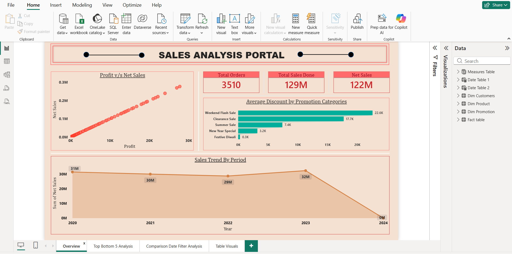
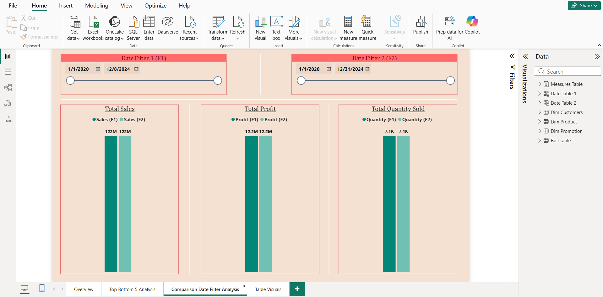
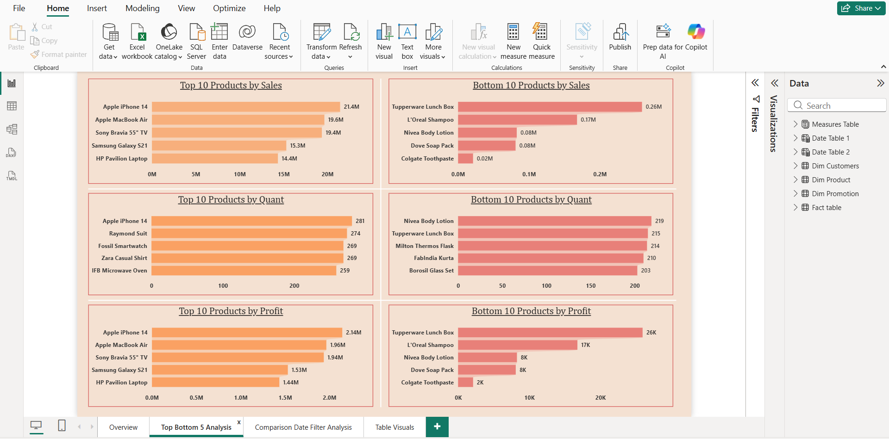
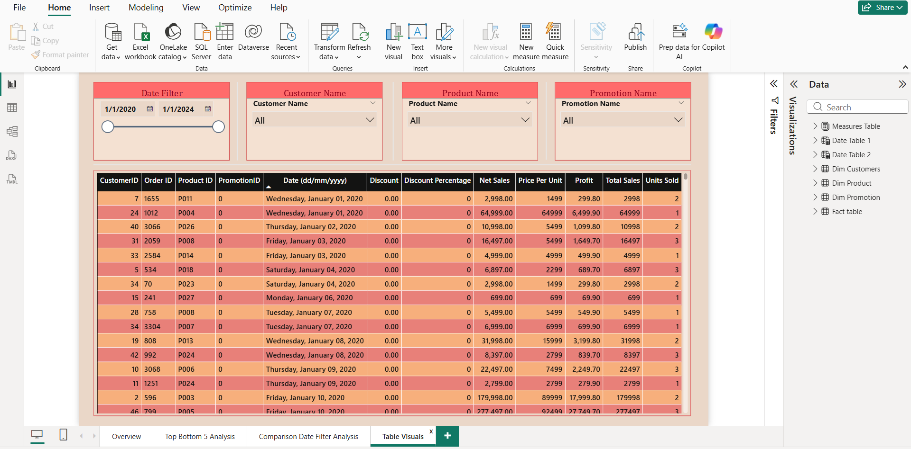

# Global Sales and Profitability Dashboard 📈

## 1. Overview
Developed a dynamic Power BI dashboard to monitor key sales performance indicators (KPIs) across various regions, products, and customer segments. The primary goal was to provide executives with clear visibility into profitability drivers and temporal trends.

---

## 🖼️ Primary Performance Overview
This section serves as the executive summary, providing instantaneous visibility into the global sales landscape, key financial metrics (Revenue, Profit Margin), and high-level regional performance.

**

[Image of Sales Dashboard Overview]
**

---

## 2. Advanced Time Intelligence and Comparison Filtering
A critical feature of this dashboard is the dynamic time comparison capability, achieved using complex measures and calculated fields. This allows users to instantly compare performance:

* **Year-over-Year (YoY) Growth**
* **Month-over-Month (MoM) Variance**
* **Custom Date Range Comparisons**

****

## 3. Top/Bottom Item and Category Analysis
This drill-down page provides a detailed view of product profitability. By isolating the best and worst performers, the dashboard enables targeted strategies, such as discontinuing low-margin products or increasing inventory for high-profit items.

****

## 4. Data Foundation and Detailed Table Views
While visualizations are key, providing access to underlying detail is necessary for verification and audit. This page showcases the clean, structured data model and enables users to export filtered raw data for deeper investigative work.

****

---

### 🎯 Goal
To accurately measure Month-over-Month (MoM) and Year-over-Year (YoY) performance changes, enabling management to quickly identify anomalies, evaluate marketing campaigns, and forecast future revenue.

## 2. Tools & Technologies
- **Business Intelligence:** Microsoft Power BI
- **DAX:** Advanced Time Intelligence Functions (`CALCULATE`, `SAMEPERIODLASTYEAR`, `DATESYTD`)
- **Data Modeling:** Calendar Table creation, Star Schema
- **Data Source:** Transactional sales data (Revenue, Cost, Units Sold, Geography)

## 3. Key Actions / Process (Metrics & Comparison)
- **Data Preparation:** Used Power Query to clean transaction data and ensured consistent data types and quality.
- **Data Modeling:** Created and integrated a dedicated **Date/Calendar Table** to guarantee accurate time-based calculations. 

[Image of Star Schema Diagram]

- **Advanced DAX:** Built robust DAX measures for Time Intelligence, including:
    - **Total Revenue (YTD, QTD)**
    - **Revenue MoM Change %**
    - **Gross Profit Margin %**
    - **Units Sold YoY Growth**
- **Comparative Analysis:** Created visualizations that allow users to compare current period performance against the previous period across regions and product lines.

## 4. Key Achievements & Results
- **Performance Monitoring:** Established a reliable system for tracking sales performance, enabling leadership to immediately focus on **underperforming regions** and **low-margin products**.
- **Efficiency:** Used DAX Time Intelligence to automate the calculation of MoM and YoY trends, **saving the Sales Operations team hours** on manual data aggregation.
- **Actionable Insights:** Identified key factors contributing to revenue spikes or dips, allowing for timely inventory and strategic pricing adjustments.

## 5. View Project
- **Live Interactive Dashboard:** [Insert Your NovyPro or Tableau Public Link HERE]
- **Source File:** SalesDataPBI.pbix (Available in this repository)
